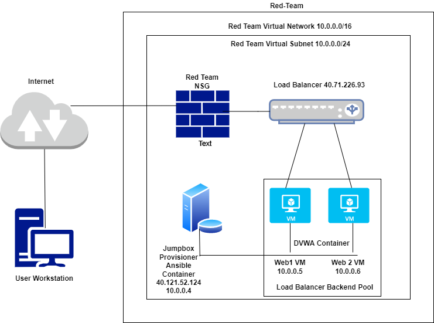
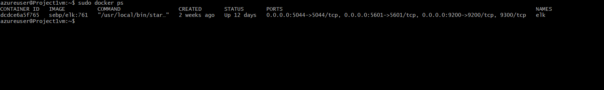

# Elk-configuration-project
## Automated ELK Stack Deployment

The files in this repository were used to configure the network depicted below.

These files have been tested and used to generate a live ELK deployment on Azure. They can be used to either recreate the entire deployment pictured above. 
Alternatively, select portions of the YAML file may be used to install only certain pieces of it, such as Filebeat.
- [My Playbook](https://github.com/eam3900/Elk-configuration-project/blob/29de442ccf696089f15eff3420511e2501d431be/Ansible/my_playbook.yml)
- [Elk Playbook](https://github.com/eam3900/Elk-configuration-project/blob/45b8985861e765794c3ddd0f3c7d16046809edd4/Ansible/elkplaybook.yml)
- [Filebeat and Metricbeat Playbook](https://github.com/eam3900/Elk-configuration-project/blob/45b8985861e765794c3ddd0f3c7d16046809edd4/Ansible/filebeat_playbook.yml)
 
This document contains the following details:
- Description of the Topology
- Access Policies
- ELK Configuration
  - Beats in Use
  - Machines Being Monitored
- How to Use the Ansible Build

### Description of the Topology

The main purpose of this network is to expose a load-balanced and monitored instance of DVWA, the D*mn Vulnerable Web Application.

Load balancing ensures that the application will be highly responsive, in addition to restricting inbound acess to the network.
- What aspect of security do load balancers protect?

Accorindg to IBM.com, load balancers allow even distribution of network traffic to prevent failure caused by overloading a particular resource.This strategy improves
the availability and performance of applications, websites, databases, and other computing resources. Additionally, this helps process user request quickly and accurately.

From a user perspective, load balancing acts as an invisible facilitator that sits between a client and a group of servers, ensuring connection request dont get lost. Without load balancing,
applications,websites,databases, and online services would likely fail when demand gets too high.

- What is the advantage of a jump box?

First, let's dive into what a jumpbox is. A jumpbox, a.k.a jump server or jump host, is a secure server that requires all system administrators to first connect to before launching any
administrative task or use as an origination point to connect to other servers or untrusted environments. The advantage of this secure computer is that it allows users 24/7 remote access while being
very restrictive at granting access.

Integrating an ELK server allows users to easily monitor the vulnerable VMs for changes to the data and system logs.

- What does Filebeat watch for?

File beat is a lightweight shipper for forwarding and centralizing log data. Filebeat's two main components work together to tail files and send event data to your specified output.

- What does Metricbeat record?

Much like Filebeat is "a lightweight shipper for forwarding and centralizing data", Metricbeat is detailed as "a lightweight shipper for metrics". Metricbeat will collect the metrics on your OS
and from the services running on the server and send them to your specified output.

The configuration details of each machine may be found below.

| Name                  | Function                      | IP Address    | Operating System              |
|------------------     |-----------------------------  |------------   |-----------------------        |
| Jump Box              | Gateway                       | 10.0.0.4      | Linux (Ubuntu 20.04)          |
| Web1_VM               | Web Server used to run DVWA   | 10.0.0.5      | Linux (Ubuntu 20.04)          |
| Web2_VM               | Web Server used to run DVWA   | 10.0.0.6      | Linux (Ubuntu 20.04)          |
| ELK                   | ELK stack container           | 10.1.0.5      | Linux (Ubuntu 20.04)          |

### Access Policies

The machines on the internal network are not exposed to the public Internet.

Only the Jump Box Provisioner machine can accept connections from the Internet. Access to this machine is only allowed from the following IP addresses: 67.150.28.177

Machines within the network can only be accessed by SSH from Jump Box.
-

A summary of the access policies in place can be found in the table below.

| Name          | Publicly Accessible   | Allowed IP Addresses          |
|-----------    |---------------------  |-----------------------        |
| Jump Box      | YES                   | 67.150.28.177                 |
| Web1 VM       | NO                    | 10.0.0.4                      |
| Web2 VM       | NO                    | 10.0.0.4                      |
| ELK           | Yes                   | 67.150.28.177                 |

### Elk Configuration

Ansible was used to automate configuration of the ELK machine. No configuration was performed manually, which is advantageous because it saves time and allows us to be more productive. By using
Ansible to configure our new Elk server, we eliminate repetative task,make fewer mistakes and errors and it improves collaboration and job satisfaction. Ansible is simple yet powerfule enough to overcome complexity.

The playbook implements the following tasks:
- Install docker.io
- Install python3-pip
- Enable Docker service

The following screenshot displays the result of running `docker ps` after successfully configuring the ELK instance.

### Target Machines & Beats
This ELK server is configured to monitor the following machines:
- Web1 VM 10.0.0.5
- Web2 VM 10.0.0.6

We have installed the following Beats on these machines:
- Filebeat
- Metricbeat

These Beats allow us to collect the following information from each machine:
- Filebeat will collect data such as 'SSH logins' which will allow us to view SSH login attemps and see how many were successful.
- Metricbeat will collect system metrics such as CPU usage and can be used to examine inconsistencies.

### Using the Playbook
In order to use the playbook, you will need to have an Ansible control node already configured. Assuming you have such a control node provisioned:

SSH into the control node and follow the steps below:
- Copy the elkplaybook.yml file to /etc/ansible.
- Update the /etc/ansible/hosts file to include the newly configured ELK serever...
- Run the playbook, and navigate to ELK VM via SSH to check that the installation worked as expected.
